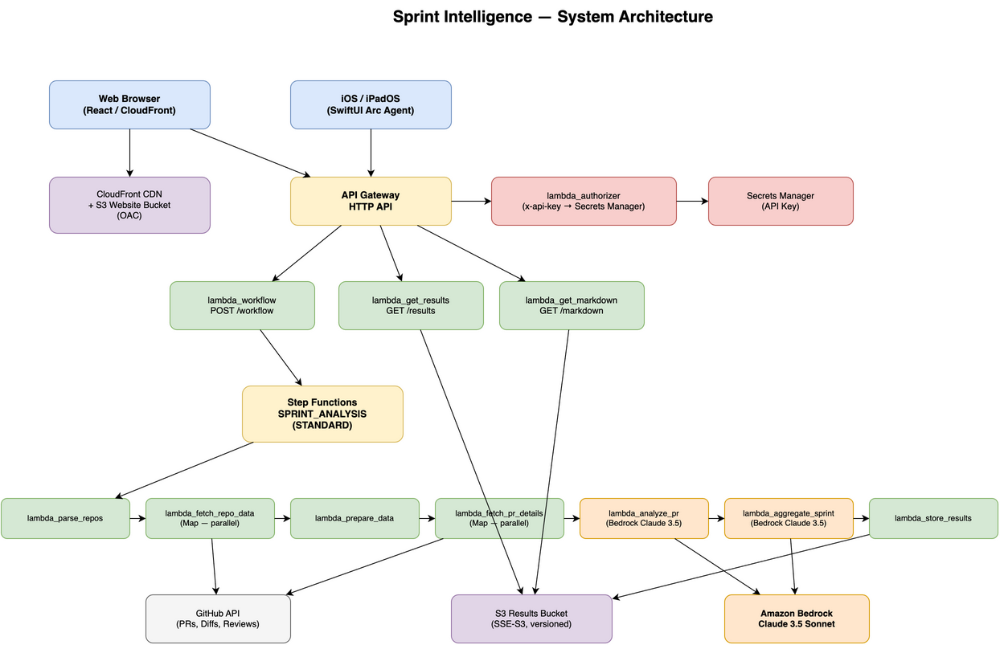

# Agentic AI Sprint Intelligence

An intelligent, autonomous system that analyzes GitHub pull requests across multiple repositories and generates comprehensive sprint reports using AI-powered agents.



## Table of Contents

- [Glossary](#glossary)
  - [Agentic AI & AI Concepts](#agentic-ai--ai-concepts)
  - [AWS Services](#aws-services)
  - [Serverless & Architecture Concepts](#serverless--architecture-concepts)
  - [GitHub & Development Terms](#github--development-terms)
  - [Infrastructure & DevOps](#infrastructure--devops)
  - [Security & Authentication](#security--authentication)
  - [Development & Operations](#development--operations)
- [What is Agentic AI?](#what-is-agentic-ai)
- [Why Agentic AI Matters](#why-agentic-ai-matters)
- [What This Application Does](#what-this-application-does)
- [How It Works: The Agentic Workflow](#how-it-works-the-agentic-workflow)
  - [Step 1: Repository Discovery](#step-1-repository-discovery-application-agent)
  - [Step 2: Context Gathering](#step-2-context-gathering-application-agents)
  - [Step 3: Deep Inspection](#step-3-deep-inspection-application-agents)
  - [Step 4: AI-Powered Analysis](#step-4-ai-powered-analysis-ai-agents)
  - [Step 5: Sprint Aggregation](#step-5-sprint-aggregation-master-ai-agent)
  - [Step 6: Result Delivery](#step-6-result-delivery-application-agent)
  - [Frontend Experience](#frontend-experience)
- [Architecture](#architecture)
  - [Serverless Stack](#serverless-stack)
  - [Key Design Principles](#key-design-principles)
- [Setup Instructions](#setup-instructions)
  - [Prerequisites](#prerequisites)
  - [Terraform Configuration](#terraform-configuration-terraformtfvars)
  - [Frontend Configuration](#frontend-configuration-env)
  - [GitHub Token Setup](#github-token-setup)
  - [Deployment](#deployment)
- [Usage](#usage)
  - [Via Web Interface](#via-web-interface-recommended)
  - [Via API](#via-api)
  - [Repository Format Options](#repository-format-options)
- [Project Structure](#project-structure)
- [Monitoring & Observability](#monitoring--observability)
  - [CloudWatch Logs](#cloudwatch-logs)
  - [Key Metrics to Monitor](#key-metrics-to-monitor)
  - [Debugging](#debugging)
- [Troubleshooting](#troubleshooting)
- [Cost Considerations](#cost-considerations)
  - [Monthly Estimate](#monthly-estimate-for-20-sprint-reports-analyzing-100-prs-total)
  - [Cost Optimization](#cost-optimization)
- [Security Best Practices](#security-best-practices)
  - [For Production Deployment](#for-production-deployment)

---

## Glossary

### Agentic AI & AI Concepts

#### Agentic AI
Autonomous AI systems that plan, execute, and adapt to accomplish goals with minimal human intervention, rather than simply responding to prompts.

#### Agent
An autonomous AI component that performs a specific task or role within a larger system. In this project, agents analyze PRs, aggregate data, and generate reports.

#### AWS Bedrock
Amazon's fully managed service for accessing foundation models from AI companies like Anthropic, including Claude.

#### Claude 3.5 Sonnet
Anthropic's large language model used for code analysis and report generation. Known for strong reasoning and technical understanding.

#### Inference Profile
AWS Bedrock configuration that enables on-demand access to foundation models across regions.

#### Token
Unit of text processing in AI models (roughly 4 characters or 0.75 words). Models have limits on input/output tokens.

#### Prompt Engineering
The practice of crafting effective instructions for AI models to produce desired outputs.

---

### AWS Services

#### API Gateway
AWS service that creates, publishes, and manages HTTP APIs. Routes requests to backend Lambda functions.

#### Lambda
AWS serverless compute service. Runs code without provisioning servers. Billed per execution and duration.

#### Step Functions
AWS workflow orchestration service. Coordinates multiple Lambda functions in complex, stateful workflows.

#### S3 (Simple Storage Service)
AWS object storage service. Used to store PR analyses and final reports.

#### Secrets Manager
AWS service for securely storing and managing secrets like API keys and tokens.

#### CloudWatch
AWS monitoring and observability service. Collects logs and metrics from all AWS services.

#### CloudFront
AWS Content Delivery Network (CDN). Serves frontend application with low latency globally.

#### ACM (AWS Certificate Manager)
Manages SSL/TLS certificates for secure HTTPS connections.

#### IAM (Identity and Access Management)
AWS service for managing permissions and access to AWS resources.

---

### Serverless & Architecture Concepts

#### Serverless
Cloud architecture where infrastructure is fully managed by the provider. No server management required.

#### State Machine
Step Functions workflow definition that orchestrates Lambda functions in a specific sequence or pattern.

#### Map State
Step Functions state that executes the same logic in parallel for each item in an array (e.g., analyzing multiple PRs simultaneously).

#### Asynchronous Execution
Operations that run in the background without blocking the API response. Results retrieved later.

#### Parallel Execution
Running multiple tasks simultaneously to reduce overall execution time.

#### Payload
The data passed between services. Step Functions has a 256KB limit per state transition.

#### Cold Start
Initial delay when a Lambda function is invoked for the first time or after being idle.

---

### GitHub & Development Terms

#### Pull Request (PR)
GitHub feature for proposing code changes. Includes diffs, comments, reviews, and metadata.

#### Repository (Repo)
A GitHub project containing code, documentation, and version history.

#### Diff
The differences between two versions of code, showing additions and deletions.

#### Merge
Integrating a PR's changes into the main branch.

#### Personal Access Token (PAT)
GitHub authentication token that grants API access without exposing passwords.

#### Fine-Grained Token
More secure GitHub token type with specific repository and permission scopes.

#### Octokit
Official GitHub REST API client library for JavaScript/TypeScript.

#### README
Markdown file describing a repository's purpose, setup, and usage.

#### Sprint
Time-boxed development period (typically 1-4 weeks) in Agile methodology.

---

### Infrastructure & DevOps

#### Terraform
Infrastructure as Code (IaC) tool for defining and deploying cloud resources declaratively.

#### tfvars
Terraform variable file containing configuration values for infrastructure deployment.

#### IaC (Infrastructure as Code)
Managing infrastructure through code rather than manual processes.

#### CORS (Cross-Origin Resource Sharing)
Security mechanism that allows web applications to request resources from different domains.

#### Environment Variables
Configuration values passed to applications at runtime (e.g., API keys, URLs).

#### .env File
Local file storing environment variables. Should never be committed to version control.

---

### Security & Authentication

#### API Key
Secret token used to authenticate API requests.

#### Lambda Authorizer
Custom API Gateway authorization function that validates requests before allowing access.

#### Least Privilege
Security principle of granting only the minimum permissions necessary for a task.

#### Origin Access Control (OAC)
CloudFront feature that securely accesses S3 without making buckets public.

#### HTTPS
Secure HTTP protocol using SSL/TLS encryption.

---

### Development & Operations

#### CloudWatch Logs
Centralized log storage for all Lambda functions and AWS services.

#### Execution ARN
Amazon Resource Name uniquely identifying a Step Functions workflow execution.

#### Timeout
Maximum time a Lambda function can run before being terminated (configurable).

#### Memory Allocation
Amount of RAM assigned to a Lambda function (also determines CPU allocation).

#### Throttling
Rate limiting to prevent excessive API usage or protect backend systems.

#### Idempotent
Operation that produces the same result when executed multiple times (important for retries).

## What is Agentic AI?

**Agentic AI** represents the next evolution in artificial intelligence—systems that don't just respond to prompts, but actively work toward goals with minimal human intervention. Unlike traditional AI that requires constant guidance, agentic AI systems:

- **Plan** their own approach to solving complex problems
- **Execute** multi-step workflows autonomously
- **Adapt** based on intermediate results and feedback
- **Make decisions** about how to handle edge cases
- **Coordinate** multiple specialized agents to accomplish tasks

This project demonstrates agentic AI principles by orchestrating multiple AI-powered agents that work together to analyze code changes, understand context, and generate actionable insights—all without human intervention beyond the initial request.

## Why Agentic AI Matters

Traditional sprint retrospectives and code review summaries require manual effort from engineering managers and team leads. They must:
- Review dozens or hundreds of pull requests manually
- Synthesize changes across multiple repositories
- Understand technical context and business impact
- Communicate findings to stakeholders

Agentic AI transforms this process by:
- **Autonomously analyzing** every PR with technical expertise
- **Understanding context** from code diffs, comments, and repository README files
- **Generating insights** about code quality, patterns, and impact
- **Producing executive-ready reports** without human intervention
- **Scaling effortlessly** across any number of repositories and PRs

This isn't just automation—it's intelligent decision-making that adapts to your codebase and team's unique context.

## What This Application Does

Sprint Intelligence is a fully serverless, agentic AI system that:

1. **Accepts** a date range and list of GitHub repositories
2. **Autonomously fetches** all merged PRs, code diffs, comments, and reviews
3. **Intelligently analyzes** each PR using AWS Bedrock Claude 3.5 Sonnet
4. **Aggregates findings** into a comprehensive sprint report
5. **Delivers results** via a professional web interface with real-time progress tracking

The system operates asynchronously, processing multiple repositories and pull requests in parallel, and provides detailed insights about:
- What changed and why
- Code quality and technical decisions
- Team contributions and activity patterns
- Sprint highlights and recommendations for future work

## How It Works: The Agentic Workflow

The application orchestrates multiple AI agents through AWS Step Functions, creating an autonomous pipeline:

### Step 1: Repository Discovery (Application Agent)
- Parses GitHub repository URLs from various formats
- Validates and normalizes repository identifiers
- Prepares data structures for parallel processing

### Step 2: Context Gathering (Application Agents)
- **Parallel execution** across all repositories
- Fetches README files to understand application purpose
- Retrieves all PRs merged within the specified date range
- Collects PR metadata, labels, and author information

### Step 3: Deep Inspection (Application Agents)
- **Parallel execution** for each PR
- Fetches complete PR details: comments, reviews, code diffs
- Intelligently summarizes large datasets to manage payload limits
- Prioritizes relevant information (recent comments, significant file changes)
- Calculates statistics and discussion metrics

### Step 4: AI-Powered Analysis (AI Agents)
- **Parallel execution** with Claude 3.5 Sonnet for each PR
- Each AI agent acts as an expert software engineer
- Analyzes code changes, comments, and context
- Generates comprehensive technical assessments
- Categorizes changes and assesses impact
- Stores full analysis in S3 for scalability

### Step 5: Sprint Aggregation (Master AI Agent)
- Retrieves all individual PR analyses from S3
- Synthesizes findings across all repositories
- Identifies patterns, trends, and team dynamics
- Generates executive-level sprint summary
- Provides actionable recommendations
- Creates markdown-formatted report

### Step 6: Result Delivery (Application Agent)
- Stores final report in S3 (JSON and Markdown formats)
- Returns report metadata to frontend
- Enables report display in professional modal interface

### Frontend Experience
- Real-time progress bar (50 seconds) showing every workflow step
- Visual distinction between Application and AI steps
- Live display of repositories and date ranges being analyzed
- Professional report modal with markdown rendering
- Persistent step history that remains visible after completion
- Mobile-responsive design for viewing on any device

## Architecture

### Serverless Stack
- **AWS Lambda** (Node.js 20): 11 specialized functions
- **AWS Step Functions**: Orchestrates the agentic workflow
- **AWS Bedrock**: Claude 3.5 Sonnet v2 for AI analysis
- **AWS S3**: Stores PR analyses and final reports
- **AWS API Gateway**: HTTP API with custom domain
- **AWS Secrets Manager**: Secure API key storage
- **React Frontend**: Professional UI hosted on S3 + CloudFront

### Key Design Principles
- **Stateless agents**: Each Lambda function is a specialized agent
- **Parallel execution**: Maximum throughput with Step Functions Map states
- **Intelligent summarization**: Handles GitHub data size constraints
- **S3-based scalability**: Avoids Step Functions payload limits
- **Asynchronous operation**: No API Gateway timeout constraints
- **Secure by design**: No secrets in code, tokens never stored

## Setup Instructions

### Prerequisites

1. **AWS Account** with permissions for:
   - Lambda, Step Functions, API Gateway, S3, Secrets Manager, CloudFront
   - IAM role creation
   - ACM certificate management
   - Route 53 (if using custom domain)

2. **Local Development Tools**:
   - AWS CLI configured with credentials
   - Terraform >= 1.0
   - Node.js >= 20.x

3. **AWS Bedrock Access**:
   - Ensure Bedrock is available in your region (us-east-1 recommended)
   - Request access to Claude 3.5 Sonnet model in Bedrock console
   - Verify model access is granted before deployment

4. **Domain** (optional but recommended):
   - Domain configured in Route 53
   - ACM certificate for HTTPS

5. **GitHub Access**:
   - GitHub account with access to repositories
   - Ability to create Personal Access Tokens

### Terraform Configuration (`terraform.tfvars`)

Create `terraform/terraform.tfvars` with your infrastructure settings:

```hcl
# AWS Configuration
region      = "us-east-1"
environment = "dev"

# Domain Configuration (if using custom domain)
domain = "yourdomain.com"

# Bedrock Model (default: us.anthropic.claude-3-5-sonnet-20241022-v2:0)
# Only change if using a different model
bedrock_model_id = "us.anthropic.claude-3-5-sonnet-20241022-v2:0"

# Console URL for Step Functions (default includes region variable)
# Only customize if your AWS console URL differs
console_url = "https://console.aws.amazon.com/states/home"

# Resource Tags
tags = {
  Project     = "agentic-ai-sprint-intelligence"
  Owner       = "YourName"
  Environment = "dev"
  ManagedBy   = "terraform"
}
```

**What goes in `terraform.tfvars`**:
- AWS region and environment name
- Domain configuration for API Gateway
- Bedrock model ID (if customizing)
- AWS console URL (if customizing)
- Resource tags for cost tracking and organization
- Any infrastructure-level settings

**Never put in `terraform.tfvars`**:
- API keys or secrets (these are auto-generated and stored in Secrets Manager)
- GitHub tokens (these are passed per-request)
- Sensitive credentials of any kind

### Frontend Configuration (`.env`)

Create `static_site/.env` for the React application:

```bash
# API Configuration
REACT_APP_API_URL=https://api.yourdomain.com
REACT_APP_API_KEY=your-api-key-from-secrets-manager

# GitHub Configuration
REACT_APP_GITHUB_TOKEN=your-github-personal-access-token

# Default Analysis Settings
REACT_APP_DEFAULT_SINCE=2024-01-01T00:00:00Z
REACT_APP_DEFAULT_UNTIL=2025-12-31T23:59:59Z

# Default Repositories (comma-separated)
REACT_APP_DEFAULT_REPOS=https://github.com/owner/repo1,https://github.com/owner/repo2
```

**What goes in `.env`**:
- API Gateway URL (output from Terraform)
- API key (retrieve from AWS Secrets Manager after deployment)
- GitHub Personal Access Token (see GitHub Token Setup below)
- Default date ranges for analysis
- Default repository URLs to analyze

**Security Warning**: 
The `.env` file is used by Create React App and **secrets are embedded in the built JavaScript**. This means:
- **Acceptable for internal/demo use**: When the app is behind authentication or for personal use
- **NOT secure for public deployment**: Anyone can view the source and extract secrets
- **Production recommendation**: Use a backend proxy that stores secrets server-side

**Never commit `.env` to version control**:
- The `.gitignore` is configured to exclude `.env`
- An `.env.example` file is provided as a template
- Always add `.env` to your `.gitignore` before committing

### GitHub Token Setup

Create a GitHub Personal Access Token for API access:

#### Option 1: Classic Token (Simpler)

1. Go to GitHub Settings → Developer settings → Personal access tokens → Tokens (classic)
2. Click "Generate new token (classic)"
3. Give it a descriptive name (e.g., "Sprint Intelligence")
4. Select scopes based on repository access:
   - **For public repos only**: `public_repo`
   - **For private repos**: `repo` (full control)
5. Generate token and copy it (starts with `ghp_`)

#### Option 2: Fine-Grained Token (More Secure)

1. Go to GitHub Settings → Developer settings → Personal access tokens → Fine-grained tokens
2. Click "Generate new token"
3. Select repository access:
   - All repositories, or
   - Only select repositories
4. Set permissions:
   - **Contents**: Read-only
   - **Pull requests**: Read-only
   - **Metadata**: Read-only (auto-included)
5. Generate token and copy it

**What the token is used for** (all read-only operations):
- Reading repository README files
- Listing merged pull requests in date range
- Reading PR metadata (title, description, labels)
- Reading PR comments and reviews
- Reading code diffs

**The token is NEVER stored permanently**—it's only used during execution and must be provided with each request.

### Deployment

1. **Initialize Terraform**:
```bash
cd terraform
terraform init
```

2. **Review the plan**:
```bash
terraform plan
```

3. **Deploy infrastructure**:
```bash
terraform apply
```

4. **Retrieve outputs**:
```bash
# Get API Gateway URL
terraform output api_url

# Get API Key from Secrets Manager
aws secretsmanager get-secret-value \
  --secret-id $(terraform output -raw api_key_secret_name) \
  --query SecretString \
  --output text

# Get S3 bucket name for reports
terraform output results_bucket_id
```

5. **Configure Frontend**:
   - Update `static_site/.env` with the outputs from step 4
   - Add your GitHub token
   - Set default repositories and date ranges

6. **Build and Deploy Frontend**:
```bash
cd static_site
npm install
npm run build

# Deploy to S3 (if using S3 hosting)
aws s3 sync build/ s3://your-frontend-bucket/
```

7. **Test the System**:
```bash
# Using cURL
curl -X POST https://api.yourdomain.com/sprint-intelligence \
  -H "Content-Type: application/json" \
  -H "x-api-key: YOUR_API_KEY" \
  -d '{
    "sprintName": "Test Sprint",
    "since": "2024-01-01T00:00:00Z",
    "until": "2024-01-31T23:59:59Z",
    "githubToken": "YOUR_GITHUB_TOKEN",
    "repos": ["https://github.com/owner/repo"]
  }'
```

## Usage

### Via Web Interface (Recommended)

1. Open the deployed React application in your browser
2. Click "Run Sprint Analysis"
3. Watch the real-time progress bar showing each workflow step
4. View the professional report in a modal when complete
5. Close the modal—workflow steps remain visible for reference

### Via API

Make a POST request to `/sprint-intelligence` with:

```json
{
  "sprintName": "Sprint 2024-Q1",
  "since": "2024-01-01T00:00:00Z",
  "until": "2024-03-31T23:59:59Z",
  "githubToken": "ghp_your_token_here",
  "repos": [
    "https://github.com/owner/repo1",
    "https://github.com/owner/repo2"
  ]
}
```

**Response**: Returns `executionArn` for tracking. The workflow runs asynchronously, and results are stored in S3 when complete.

### Repository Format Options

The system accepts multiple formats:

```json
"repos": [
  "https://github.com/owner/repo",
  "git@github.com:owner/repo.git",
  "owner/repo",
  {"owner": "owner", "repo": "repo"}
]
```

## Project Structure

```
.
├── README.md
├── terraform/
│   ├── *.tf                           # Terraform infrastructure
│   ├── lambda_*/                      # Lambda function source code
│   │   ├── index.ts                   # Function implementation
│   │   ├── package.json               # Dependencies
│   │   └── tsconfig.json              # TypeScript config
│   └── terraform.tfvars               # Your configuration (not committed)
│
└── static_site/                       # React frontend
    ├── public/
    │   ├── index.html                 # HTML template
    │   ├── manifest.json              # PWA manifest
    │   └── favicon.png                # Favicon
    ├── src/
    │   ├── App.js                     # Main React component
    │   ├── App.css                    # Application styles
    │   ├── index.js                   # React entry point
    │   ├── index.css                  # Global styles
    │   └── bsc-logo.svg               # Logo
    ├── .env                           # Your configuration (not committed)
    ├── .env.example                   # Template for .env
    └── package.json                   # React dependencies
```

## Monitoring & Observability

### CloudWatch Logs
- All Lambda functions log to CloudWatch with detailed execution information
- Step Functions execution history available in AWS console
- Use the `statusUrl` from API response to view workflow execution

### Key Metrics to Monitor
- Step Functions execution duration and status
- Lambda concurrent executions and errors
- API Gateway 4xx/5xx error rates
- Bedrock API latency and throttling

### Debugging
```bash
# View Lambda logs
aws logs tail /aws/lambda/FUNCTION_NAME --follow

# Check Step Functions execution
aws stepfunctions describe-execution --execution-arn YOUR_EXECUTION_ARN

# List S3 reports
aws s3 ls s3://YOUR_RESULTS_BUCKET/reports/ --recursive
```

## Troubleshooting

### "Service Unavailable" or API Timeout
- Expected behavior—workflow runs asynchronously
- Check Step Functions console using the returned `executionArn`
- Results stored in S3 when complete

### "Rate Limit Exceeded"
- GitHub API limits: 5,000 requests/hour for authenticated users
- Solution: Reduce repositories or date range, or use GitHub App for higher limits

### "Invalid API Key"
- Verify `x-api-key` header is correct
- Check Secrets Manager for current API key value
- Ensure frontend `.env` has correct `REACT_APP_API_KEY`

### "No Pull Requests Found"
- Verify date range includes merged PRs
- Confirm GitHub token has access to repositories
- Check token permissions (needs `repo` or `public_repo` scope)

### Frontend Not Loading Report
- Check browser console for errors
- Verify API Gateway URL in `.env` is correct
- Confirm CORS is enabled (handled by Terraform)
- Check Step Functions execution status

### Bedrock Access Denied
- Verify Claude 3.5 Sonnet access is granted in Bedrock console
- Check Lambda IAM role has `bedrock:InvokeModel` permission
- Ensure correct model ID is configured

## Cost Considerations

### Monthly Estimate (for ~20 sprint reports analyzing 100 PRs total)
- **API Gateway**: ~$0.10
- **Lambda**: ~$5-10 (varies with execution time)
- **Step Functions**: ~$0.50
- **Bedrock**: ~$5-15 (based on token usage)
- **S3 + CloudFront**: ~$1-2
- **Total**: ~$12-30/month

### Cost Optimization
- Adjust Lambda memory based on actual usage
- Use shorter CloudWatch log retention (7 days default)
- Monitor Bedrock token usage and optimize prompts
- Clean up old S3 reports (lifecycle policy configured for 90 days)

## Security Best Practices

### For Production Deployment
1. **Use a backend proxy** instead of storing secrets in frontend `.env`
2. **Implement user authentication** (Cognito, Auth0, etc.)
3. **Rotate API keys regularly** in Secrets Manager
4. **Use fine-grained GitHub tokens** with minimal permissions
5. **Enable AWS CloudTrail** for audit logging
6. **Set up CloudWatch alarms** for unusual activity
7. **Use AWS WAF** on API Gateway for DDoS protection
