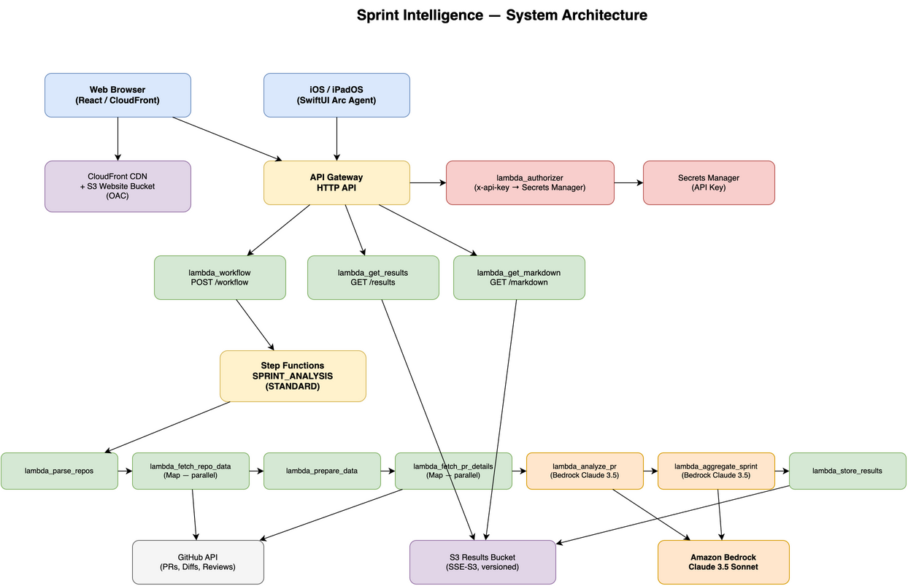
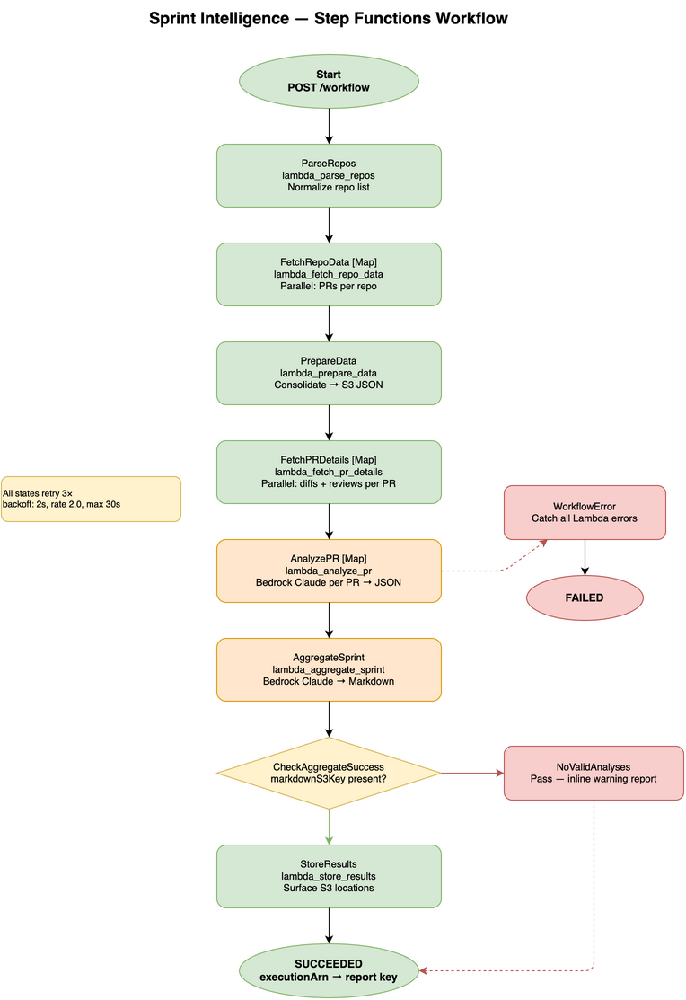
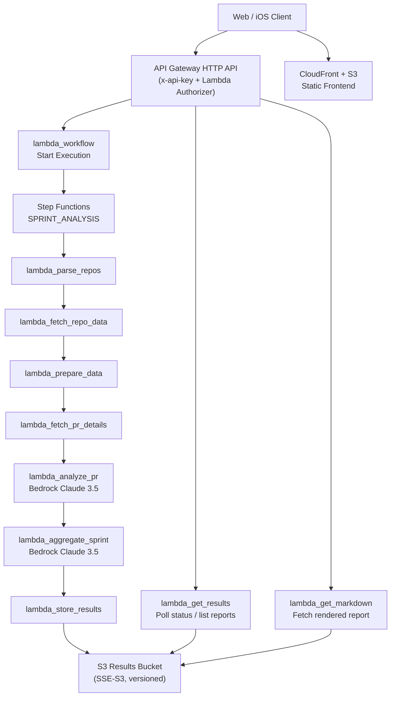
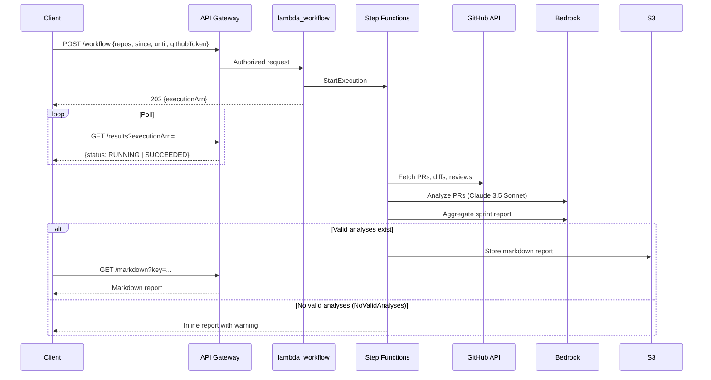

# Sprint Intelligence

An enterprise-grade agentic AI system that analyzes GitHub sprint activity and generates executive-quality reports. Designed as application-first agentic AI — roughly 70% deterministic orchestration and 30% AI reasoning.





## Architecture


```mermaid
graph TD
    Client["Web / iOS Client"]
    APIGW["API Gateway HTTP API\n(x-api-key + Lambda Authorizer)"]
    WF["lambda_workflow\nStart Execution"]
    SFN["Step Functions\nSPRINT_ANALYSIS"]
    PR["lambda_parse_repos"]
    FR["lambda_fetch_repo_data"]
    FPR["lambda_fetch_pr_details"]
    PD["lambda_prepare_data"]
    AP["lambda_analyze_pr\nBedrock Claude 3.5"]
    AS["lambda_aggregate_sprint\nBedrock Claude 3.5"]
    SR["lambda_store_results"]
    GR["lambda_get_results\nPoll status / list reports"]
    GM["lambda_get_markdown\nFetch rendered report"]
    S3["S3 Results Bucket\n(SSE-S3, versioned)"]
    CF["CloudFront + S3\nStatic Frontend"]

    Client --> CF
    Client --> APIGW
    APIGW --> WF
    APIGW --> GR
    APIGW --> GM
    WF --> SFN
    SFN --> PR --> FR --> PD --> FPR --> AP --> AS --> SR
    SR --> S3
    GR --> S3
    GM --> S3
```

### Lambda Functions

| Function | Route | Purpose |
|---|---|---|
| `lambda_authorizer` | — | Custom Lambda authorizer; validates `x-api-key` against Secrets Manager |
| `lambda_workflow` | `POST /workflow` | Validates request, starts Step Functions execution, returns `executionArn` |
| `lambda_parse_repos` | Step | Normalizes GitHub URLs (`owner/repo`, HTTPS, SSH) into structured list |
| `lambda_fetch_repo_data` | Step | Fetches PR metadata per repo via GitHub API (parallel Map) |
| `lambda_prepare_data` | Step | Aggregates raw PR data, writes consolidated JSON to S3 |
| `lambda_fetch_pr_details` | Step | Fetches diffs, comments, reviews per PR (parallel Map) |
| `lambda_analyze_pr` | Step | Invokes Bedrock Claude per PR to produce structured analysis JSON |
| `lambda_aggregate_sprint` | Step | Invokes Bedrock Claude across all PR analyses to produce markdown sprint report |
| `lambda_store_results` | Step | Validates and surfaces final S3 locations as execution output |
| `lambda_get_results` | `GET /results` | Polls execution status by `executionArn`; lists reports (`?list=true`) |
| `lambda_get_markdown` | `GET /markdown` | Retrieves a specific markdown report from S3 by `?key=` |

All routes are protected by the custom Lambda authorizer (`authorization_type = "CUSTOM"`).

## Repository Layout

```
agentic_ai/
├── architecture/          # Draw.io source files
│   ├── architecture.drawio
│   └── workflow.drawio
├── img/                   # Generated PNG diagrams
│   ├── architecture.png
│   └── workflow.png
├── mobile/
│   └── Arc Agent/         # SwiftUI iOS/iPadOS app
├── static_site/           # React frontend (CRA)
│   └── src/
│       ├── components/
│       ├── config/settings.js
│       ├── utils/api.js
│       └── __tests__/
├── backend/
│   ├── shared/            # @sprint/shared — shared TypeScript utilities
│   └── <name>/            # Individual Lambda handlers (name = function_name suffix)
└── terraform/
    └── *.tf               # Terraform resources (infra only; code lives in backend/)
```

## Prerequisites

| Tool | Version |
|---|---|
| Node.js | 20.x |
| Terraform | ≥ 1.5 |
| AWS CLI | ≥ 2 |
| Xcode | ≥ 15 |
| drawio CLI | any |

## Secrets Setup

**Never commit real secrets.** All sensitive values live in exactly one of:

- `terraform/*.tfvars` — Terraform variables (gitignored)
- `mobile/Arc Agent/Arc Agent/Secrets.swift` — iOS constants (gitignored)
- `static_site/.env.local` — React environment overrides (gitignored)

Copy the example file before building the iOS app:

```bash
cp "mobile/Arc Agent/Arc Agent/Secrets.swift.example" \
   "mobile/Arc Agent/Arc Agent/Secrets.swift"
# Edit Secrets.swift with real values
```

Retrieve the generated API key after `terraform apply`:

```bash
aws secretsmanager get-secret-value \
  --secret-id "$(terraform -chdir=terraform output -raw api_key_secret_name)" \
  --query SecretString --output text | jq -r .API_KEY
```

## Infrastructure

```bash
cd terraform
cp terraform.tfvars.example terraform.tfvars   # fill in domain, environment, region
terraform init
terraform plan -out=plan.out
terraform apply plan.out
```

Outputs after apply:

| Output | Description |
|---|---|
| `api_url` | API Gateway base URL (`https://api.<domain>`) |
| `frontend_url` | CloudFront frontend URL (`https://<env>.<domain>`) |
| `results_bucket` | S3 bucket name for sprint reports |
| `api_key_secret_name` | Secrets Manager secret containing `API_KEY` |

## Frontend

```bash
cd static_site
cp .env.example .env.local   # set REACT_APP_API_URL, REACT_APP_API_KEY
npm install
npm start        # development server
npm run build    # production build (deploy to S3 via Terraform)
```

## Testing

### Shared Lambda Library

```bash
cd backend/shared
npm install
npm test
```

### Individual Lambda Functions

```bash
# Run tests for a single lambda
cd backend/workflow_proxy
npm test

# Run all lambda tests
for dir in backend/*/; do
  [[ "$dir" == "backend/shared/" ]] && continue
  echo "=== $dir ===" && (cd "$dir" && npm test --passWithNoTests)
done
```

### React Frontend

```bash
cd static_site
npm test
```

### iOS

```bash
xcodebuild test \
  -project "mobile/Arc Agent/Arc Agent.xcodeproj" \
  -scheme "Arc Agent" \
  -destination "platform=iOS Simulator,name=iPhone 17"
```

### Terraform

```bash
cd terraform
terraform fmt -check -recursive
terraform validate
```

## Workflow


```mermaid
sequenceDiagram
    participant C as Client
    participant A as API Gateway
    participant W as lambda_workflow
    participant S as Step Functions
    participant G as GitHub API
    participant B as Bedrock

    C->>A: POST /workflow {repos, since, until, githubToken}
    A->>W: Authorized request
    W->>S: StartExecution
    W-->>C: 202 {executionArn}
    loop Poll
        C->>A: GET /results?executionArn=...
        A-->>C: {status: RUNNING | SUCCEEDED}
    end
    S->>G: Fetch PRs, diffs, reviews
    S->>B: Analyze PRs (Claude 3.5 Sonnet)
    S->>B: Aggregate sprint report
    alt Valid analyses exist
        S->>S3: Store markdown report
        C->>A: GET /markdown?key=...
        A-->>C: Markdown report
    else No valid analyses (NoValidAnalyses)
        S-->>C: Inline report with warning
    end
```

## Security

- Every API Gateway route uses `authorization_type = "CUSTOM"` (Lambda authorizer)
- API key is stored in Secrets Manager; rotatable without redeployment
- `x-api-key` is redacted in all Lambda logs by the shared logger
- CORS is restricted to `https://<env>.<domain>`
- S3 results bucket: SSE-S3, versioning enabled, 90-day lifecycle on old versions
- CloudFront serves the frontend via Origin Access Control (OAC)
- `Secrets.swift` and all `.tfvars` files are gitignored

## CI/CD

Three path-filtered GitHub Actions workflows run automatically. `mobile/` changes are ignored by CI.

| Workflow | Triggers on | PR action | Push to `main` action |
|---|---|---|---|
| `frontend.yml` | `static_site/**` | test + build | test + build + S3 sync + CloudFront invalidation |
| `backend.yml` | `backend/**` | build shared → test changed lambdas | build shared → test → `aws lambda update-function-code` (per changed lambda) |
| `terraform.yml` | `terraform/**` | plan (PR comment) | plan → apply |

### Required GitHub repository variables and secrets

After the first manual `terraform apply`, populate these under **Settings → Secrets and variables → Actions**:

**Variables** (plaintext, visible in logs):

| Variable | How to get the value |
|---|---|
| `AWS_ROLE_ARN` | `terraform output -raw github_actions_role_arn` |
| `SITE_BUCKET` | `terraform output -raw site_bucket_name` |
| `CLOUDFRONT_DISTRIBUTION_ID` | `terraform output -raw cloudfront_distribution_id` |
| `REACT_APP_API_URL` | `terraform output -raw api_url` |

**Secrets** (encrypted, never visible in logs):

| Secret | How to get the value |
|---|---|
| `REACT_APP_API_KEY` | Value of the API key stored in Secrets Manager (`terraform output -raw api_key_secret_name`, then read via AWS console or `aws secretsmanager get-secret-value`) |

### First-time setup

```bash
# 1. Apply infrastructure (creates OIDC provider + IAM role)
cd terraform
terraform apply

# 2. Capture outputs into GitHub repo variables and secrets
gh variable set AWS_ROLE_ARN               --body "$(terraform output -raw github_actions_role_arn)"
gh variable set SITE_BUCKET                --body "$(terraform output -raw site_bucket_name)"
gh variable set CLOUDFRONT_DISTRIBUTION_ID --body "$(terraform output -raw cloudfront_distribution_id)"
gh variable set REACT_APP_API_URL          --body "$(terraform output -raw api_url)"
# 3. Set the API key as an encrypted secret
API_KEY=$(aws secretsmanager get-secret-value \
  --secret-id "$(terraform output -raw api_key_secret_name)" \
  --query SecretString --output text | jq -r .API_KEY)
gh secret set REACT_APP_API_KEY --body "$API_KEY"
```

After that, every pull request touching `terraform/` will receive an auto-posted plan comment, every push to `main` that touches `backend/` will directly update Lambda function code, and every push to `main` that touches `terraform/` will run a full apply.

### Frontend deploy details

The S3 sync uses split cache-control headers:
- Hashed assets (`static/js/*.js`, `static/css/*.css`) → `max-age=31536000,immutable`
- Entry points (`index.html`, `asset-manifest.json`) → `max-age=0,must-revalidate`

A CloudFront invalidation on `/*` follows every deploy.

## Contributing

1. Follow the coding conventions in `.cursor/rules/`
2. Add unit tests for any new Lambda handler logic
3. Run `terraform fmt` before committing Terraform changes
4. Keep `AGENTS.md` current when adding routes or changing auth behavior
